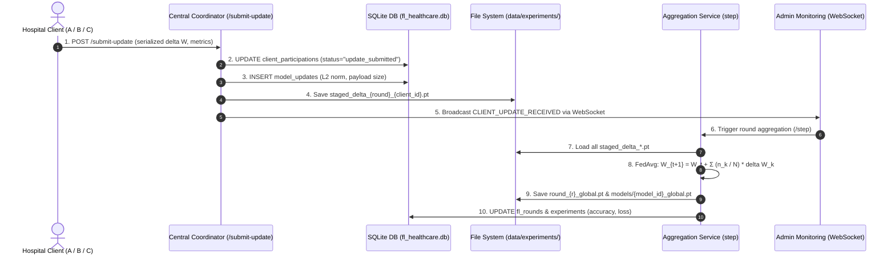

# A Web-Based Federated Learning Platform with LLM-Based Automation for Healthcare

[](https://web-based-federated-learning-with-llm.vercel.app)
[](https://web-based-federated-learning-with-llm.onrender.com)
[](https://web-based-federated-learning-with-llm.onrender.com/docs)
[](https://github.com/udaykonkal/Web-Based-Federated-Learning-with-LLM)

> 🌐 **Live Demo**: [web-based-federated-learning-with-llm.vercel.app](https://web-based-federated-learning-with-llm.vercel.app)
> 🔗 **Backend API**: [web-based-federated-learning-with-llm.onrender.com](https://web-based-federated-learning-with-llm.onrender.com)
> 📖 **API Docs**: [web-based-federated-learning-with-llm.onrender.com/docs](https://web-based-federated-learning-with-llm.onrender.com/docs)

An end-to-end, production-grade healthcare Federated Learning (FL) platform built for academic research and final-year major project demonstration.

---

## Architectural Core: Separation of Concerns

```
┌───────────────────────────────────────────────────────────┐
│              SIDE A: CENTRAL SERVER / ADMIN               │
│                  (FL Coordinator Node)                    │
│                                                           │
│  • Manages & Publishes Healthcare Models & Datasets       │
│  • Performs FedAvg Aggregation (Zero Local Training)      │
│  • Adaptive Client Selection & Fairness Regularization    │
│  • Mathematical Update Verification & Cosine Defense      │
│  • Structured LLM Reasoning with Deterministic Fallback   │
└─────────────────────────────┬─────────────────────────────┘
                              │
               Global Models  │  Model Updates Only (ΔW)
               & Parameters   │  (Zero Raw Patient Data)
                              ▼
┌───────────────────────────────────────────────────────────┐
│              SIDE B: THREE ISOLATED CLIENTS               │
│                                                           │
│  [Client 1: Hospital A]  [Client 2: Hospital B]  [Client 3]
│  • Private Non-IID Data  • Private Non-IID Data  • Non-IID
│  • PyTorch Local Train   • PyTorch Local Train   • Train
│  • Model Delta Upload    • Model Delta Upload    • Delta
└───────────────────────────────────────────────────────────┘
```

### Non-Negotiable Privacy & Architectural Rules
1. **Zero Raw Patient Data Leakage**: Raw patient records are strictly retained on client premises. Only local model weight deltas ($\Delta W$) and scalar evaluation metrics are transmitted.
2. **Coordinator Separation**: The central Admin server coordinates experiments, verifies incoming update vectors, and executes FedAvg, but **never** accesses local patient data or performs local training.
3. **Model Availability Control**: Clients cannot train until Admin publishes an active model.
4. **Cross-Client Isolation**: Hospital A, B, and C maintain strict silo isolation. No client can inspect another institution's data or parameters.
5. **Dual Healthcare Tasks**: Dedicated isolated neural architectures for **Diabetes Prediction** (8 clinical features) and **Cardiology Risk Prediction** (13 clinical features).

---

## Pre-seeded Credentials (Initial Setup)

| Role | Account / Entity | Email | Password | Identifier |
| :--- | :--- | :--- | :--- | :--- |
| **Admin** | Central FL Coordinator | `admin@flplatform.org` | `admin123` | - |
| **Client 1** | Hospital A (Regional Medical Center) | `hospital_a@flplatform.org` | `client1pass` | `client_1` |
| **Client 2** | Hospital B (Community Healthcare) | `hospital_b@flplatform.org` | `client2pass` | `client_2` |
| **Client 3** | Hospital C (University Clinic) | `hospital_c@flplatform.org` | `client3pass` | `client_3` |

---

## How to Run the Project

### Prerequisites
- **Python 3.10+**
- **Node.js 18+** & **npm**

---

### Step 1: Start the Central Coordinator Backend (FastAPI + PyTorch)

Open a terminal in the project root:

```powershell
# 1. (Optional) Activate your virtual environment if you use one
# .venv\Scripts\Activate.ps1

# 2. Install backend dependencies (first time only)
pip install -r backend/requirements.txt

# 3. Start the FastAPI backend server
cd backend
python -m uvicorn app.main:app --host 127.0.0.1 --port 8000 --reload
```

- **Backend API**: `http://127.0.0.1:8000`
- **Interactive Swagger Docs**: `http://127.0.0.1:8000/docs`

---

### Step 2: Start the Web Dashboard Frontend (React + Vite)

Open a second terminal:

```powershell
# 1. Navigate to frontend directory
cd frontend

# 2. Install dependencies (first time only)
npm install

# 3. Start the development server
npm run dev
```

- **Web Application URL**: `http://localhost:5173`

---

### Step 3: Run the Platform (Step-by-Step User Flow)

#### A. Central Coordinator (Admin Portal)
1. Navigate to `http://localhost:5173` and log in as Admin (`admin@flplatform.org` / `admin123`).
2. **Healthcare Datasets** (`/admin/datasets`): Verify pre-seeded benchmark datasets (Diabetes 768 records, Heart Disease 303 records).
3. **Healthcare Models** (`/admin/models`): Ensure models are set to **"Active / Published"** status so client hospitals can access them.
4. **FL Experiments** (`/admin/experiments`):
   - View active or completed trials.
   - Click **"Step Next FL Round"** to trigger local hospital training, mathematical verification, and FedAvg aggregation.
   - Click **"Run All Rounds"** to execute the complete federation lifecycle automatically.
   - Delete any experiment with 1 click using the **Trash / Delete** button.

#### B. Clinical Client (Hospital Portal)
1. Log in as Hospital A (`hospital_a@flplatform.org` / `client1pass`).
2. Click **Available Models** (`/client/models`) to select the published model.
3. Open the **Interactive Workspace** (`/client/workspace`):
   - **Google Colab-Style Interface**: Run cells individually (`In [1]`, `In [2]`, `In [3]`, `In [4]`) with real-time execution timing and console outputs, or click **"Run All Cells"**.
   - **Cohort Scale Selection**: Choose between **Standard (345 records)** or **Multi-Center Large (3,500 records)** cohort for rigorous non-IID stress testing.
   - **Offline Local Runner**: Switch to the *Offline Local Runner* tab to download the self-contained PyTorch training script (`client_runner.py`) to run training in an external terminal and push weights back via REST API.

---

## Where to Inspect Received Weights in Admin

When client hospitals submit local weights, they can be tracked across **3 dedicated admin views**:

1. **`FL Experiments` (`/admin/experiments`)**:
   - Scroll down to the **"Per-Client Contribution Table"**.
   - View exact **Update Size** (e.g., `18.4 KB`), **Security Verification** (`✓ Passed`), and **Aggregation Weight %** calculated from client record volumes.
2. **`Live Telemetry` (`/admin/telemetry`)**:
   - Live WebSocket stream showing client states transitioning from `idle` $\to$ `training` $\to$ `uploading` $\to$ `complete`.
   - Displays real-time $L_2$ norm ($\|\Delta W\|_2$) and timestamped `CLIENT_UPDATE_RECEIVED` events.
3. **`Security & Anomalies` (`/admin/security`)**:
   - Cosine similarity matrix against global gradient vector, anomaly scoring, and defense verification against sign-flipping and malicious weight tampering.

---

## Weight Submission & FedAvg Mathematical Flow



---

## Automated Testing & Verification

### 1. Run Backend PyTest Test Suites
```powershell
# Run client trainer and cohort scaling tests
python -m pytest backend/tests/test_trainer.py -v

# Run authentication and isolation tests
python -m pytest backend/tests/test_auth.py -v

# Run coordinator and FedAvg aggregation tests
python -m pytest backend/tests/test_coordinator.py -v
```

### 2. Run Full Live System E2E Verification
Execute the automated end-to-end multi-round verification script against the running servers:
```powershell
python verify_live_system.py
```

### 3. Verify Frontend TypeScript & Production Build
```powershell
cd frontend
npm run build
```

---

## Administrative Utilities

- **Purge Automated Test Experiments**:
  ```powershell
  python backend/scripts/purge_test_experiments.py
  ```
  *Cleans up automated unit-test runs from SQLite while safely preserving user experiments (`MVJ`, `viva demonstration trial`) and canonical completed benchmark models.*
